[distrobox](https://distrobox.it/) for the [Omarchy](https://omarchy.org) shell on
[nixarchy](https://olafkfreund.github.io/nixarchy/). Your boxes are on the bar and
behind a key, and a new one is a form away.

<figure class="shot">
  <video controls autoplay muted loop playsinline preload="metadata" poster="img/tour.png" aria-label="Recording of a tour of every feature, in the full-screen menu and the bar popup">
    <source src="img/rec-tour.webm" type="video/webm">
    <source src="img/rec-tour.mp4" type="video/mp4">
  </video>
  <figcaption>The whole thing in 90 seconds, all from the keyboard:
  <ul>
    <li>moving and filtering, and the <kbd>?</kbd> sheet;</li>
    <li>promoting a box with <kbd>p</kbd>;</li>
    <li>creating one from a template, then its first start;</li>
    <li>an upgrade;</li>
    <li>the delete and stop-all questions, both answered Cancel;</li>
    <li>the same state in the bar popup.</li>
  </ul>
  The first start really takes about 50 seconds while distrobox sets the box up; that stretch is shown 8&times; faster.</figcaption>
</figure>

## Who it is for

You run NixOS, and sometimes you need another distribution's toolchain: an Ubuntu
box for a vendor SDK, an Arch box for something from the AUR, a Fedora box to test
a package. distrobox makes that one command. This is for when you would rather
glance at your bar and press a key than remember the command.

## The problem

distrobox is excellent, and its interface is a terminal:

```
distrobox list                      # a table, and nothing else can read it
distrobox create --name dev \
  --image quay.io/toolbx/ubuntu-toolbox:24.04 \
  --home ~/.local/share/distrobox/dev --init --additional-packages "git tmux"
distrobox enter dev                 # the first start sets the box up; wait
distrobox upgrade --all             # and keep this terminal open for a while
```

- **Nothing shows state.** Nothing on your desktop says whether a box is running, or
  whether one failed.
- **Create has more than twenty options.** They are easy to get subtly wrong.
- **Short image names do not resolve.** On nixarchy, podman has no unqualified-search
  registries, so `alpine` on its own means nothing.
- **Long jobs hold a terminal.** A first start or an upgrade takes minutes, and it
  keeps a terminal busy the whole time.

## What it does

**One glyph in the bar** says how your boxes are. It is dim when nothing runs, in the
accent colour when something does, and red when a box has failed.

<figure class="shot">
  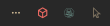
  <figcaption>The glyph in the bar, enlarged. It is red here because <code>demo-broken</code> failed its first start.</figcaption>
</figure>

**One list** shows every box, running first:
- each box's image and home directory (`~` when it shares yours);
- the state: running, stopped, created but never started, or failed with its exit
  code.

<figure class="shot">
  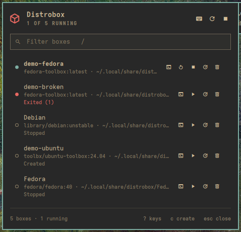
  <figcaption>The popup under the glyph:
  <ul>
    <li>a running box;</li>
    <li>one that failed, from a real <code>--init</code> on an image without systemd;</li>
    <li>one that has never been started;</li>
    <li>two of the machine's own stopped boxes.</li>
  </ul>
  Names sort without regard to case.</figcaption>
</figure>

**A form knows every `distrobox create` flag.**
- The common fields come first: name, image, pull, home, extra packages, init and
  NVIDIA.
- The rest sit behind **Advanced**: hostname, clone, volumes, engine flags, init and
  pre-init hooks, platform, the six `--unshare-*` switches, and `--no-entry`.
- The image field has a list of toolbox images that resolve on nixarchy.
- A mistake is flagged under the field before anything runs.

<div class="shot-pair">
<figure class="shot">
  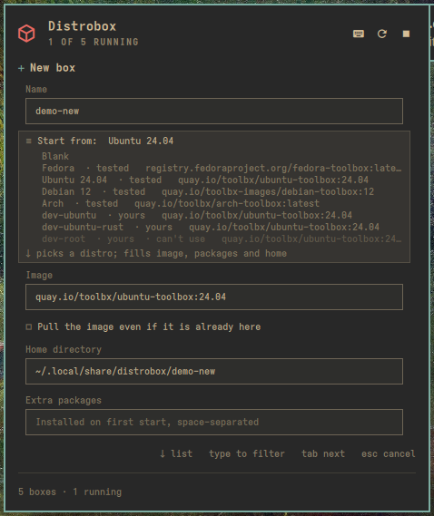
  <figcaption><kbd>c</kbd> opens the form. <kbd>tab</kbd> moves between fields, and <kbd>space</kbd> flips a switch.</figcaption>
</figure>
<figure class="shot">
  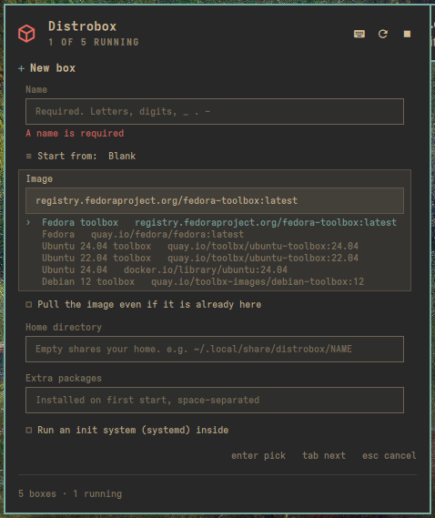
  <figcaption><kbd>↓</kbd> on Image opens the list of fully qualified images. <kbd>enter</kbd> picks one.</figcaption>
</figure>
</div>
<div class="shot-pair">
<figure class="shot">
  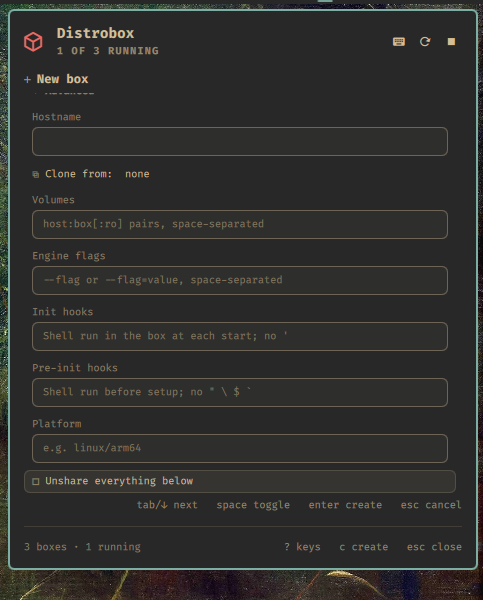
  <figcaption>Advanced: volumes, engine flags, hooks, platform and the unshare switches. Each hook field says which characters it cannot hold, and why is <a href="#why-it-is-built-this-way">below</a>.</figcaption>
</figure>
<figure class="shot">
  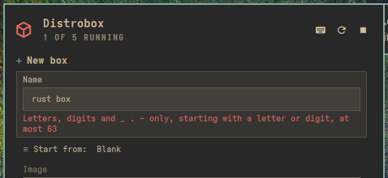
  <figcaption>A name with a space is flagged under the field, and nothing runs.</figcaption>
</figure>
</div>

**Your own templates** come from a `distrobox assemble` file,
`~/.config/distrobox/boxes.ini`. Each section appears under **Start from**, marked
*yours*. One the plugin will not run (here `root=true`) is greyed out, and picking
it says why. The plugin reads the file itself and never runs assemble.

<figure class="shot">
  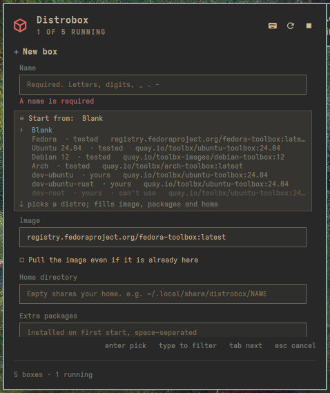
  <figcaption><kbd>↓</kbd> on <strong>Start from</strong>: the tested built-in templates, then yours. <code>dev-ubuntu-rust</code> includes <code>dev-ubuntu</code>; <code>dev-root</code> is refused.</figcaption>
</figure>

**Long jobs stream into the panel.** Create and upgrade show their output as it
arrives. <kbd>esc</kbd> goes back to the list while the job keeps running, and
<kbd>o</kbd> brings the log back. <kbd>U</kbd> upgrades every box, one at a time,
and a box that fails does not stop the rest.

<figure class="shot">
  <video controls autoplay muted loop playsinline preload="metadata" aria-label="Recording of creating a box from a template">
    <source src="img/rec-create.webm" type="video/webm">
    <source src="img/rec-create.mp4" type="video/mp4">
  </video>
  <figcaption>Creating a box: <kbd>c</kbd>, a name, the Ubuntu template, <kbd>enter</kbd>. The create streams into the panel, and <kbd>esc</kbd> goes back to the list, where the new box is waiting.</figcaption>
</figure>

<figure class="shot">
  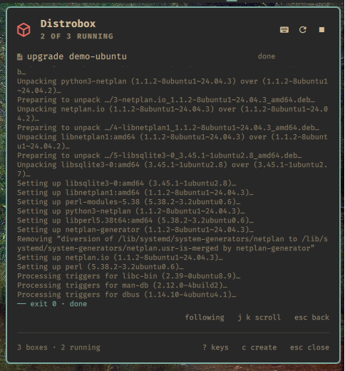
  <figcaption><kbd>g</kbd> upgraded a box's packages. The log follows the end until you scroll, and ends with the exit status.</figcaption>
</figure>

**Keep a box you made by hand.** <kbd>p</kbd> copies a Nix snippet that declares the
box in your nixarchy flake, and shows it. Paste it and rebuild, and the box is made
again on any machine. The plugin edits nothing itself.

<figure class="shot">
  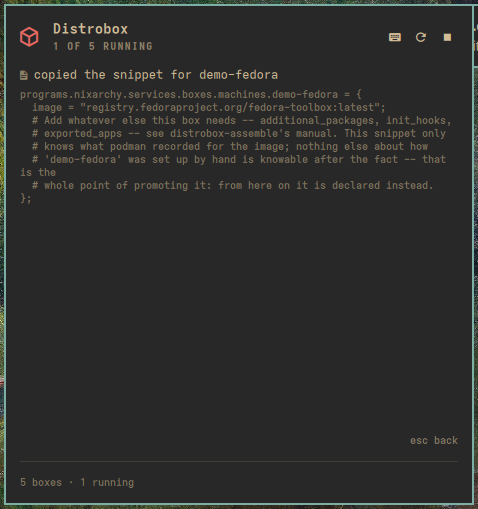
  <figcaption><kbd>p</kbd> on <code>demo-fedora</code>: the snippet is on the clipboard, and <kbd>esc</kbd> goes back.</figcaption>
</figure>

**There are two ways in.** Click the glyph for the popup, or open the larger
full-screen view from a key you bind (<kbd>Super</kbd>+<kbd>Alt</kbd>+<kbd>D</kbd>
below) or the **Distrobox** row in the Omarchy menu. It holds the keyboard until you
are done.

<figure class="shot">
  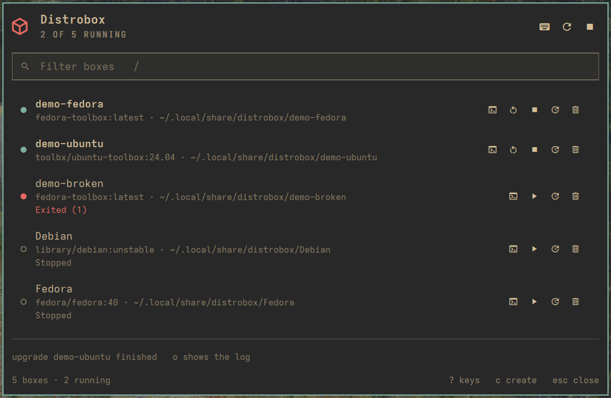
  <figcaption>The full-screen menu: the same list, form and log, drawn larger.</figcaption>
</figure>

## How it works

- **It asks the engine, not the table.** `distrobox list` prints for people. The
  plugin asks podman (or docker) directly for every container labelled
  `manager=distrobox`, which is what `distrobox list` does underneath.
- **Start waits for the box to be ready.** A box can be *running* before distrobox
  has finished setting it up. So start goes through distrobox itself
  (`distrobox enter -T -- true`), and the row says **starting…** until the setup is
  done. Enter then drops straight into a shell.
- **One change at a time.** The bar and the menu share one state. While a start,
  stop, delete, create or upgrade runs, anything else that would change a box is
  refused, and the refusal says why.
- **The engine is never guessed.** Every distrobox command runs with
  `DBX_CONTAINER_MANAGER` set to the engine you chose, so a docker setup never
  touches a podman box of the same name.

<figure class="shot">
  <video controls autoplay muted loop playsinline preload="metadata" aria-label="Recording of a box's first start">
    <source src="img/rec-start.webm" type="video/webm">
    <source src="img/rec-start.mp4" type="video/mp4">
  </video>
  <figcaption>A box's first start. <kbd>s</kbd>, and the row says <strong>starting…</strong> while distrobox sets it up. Every other change is locked until it is running.</figcaption>
</figure>
<figure class="shot">
  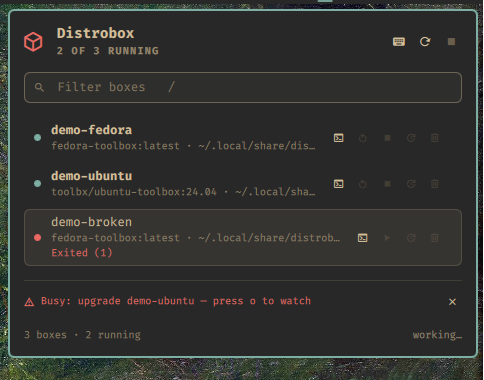
  <figcaption>A delete pressed while an upgrade runs is refused, with the reason and a way to watch the upgrade.</figcaption>
</figure>

## Why it is built this way

- **The form checks every field against what is safe where it lands.** `distrobox
  create` builds one command and runs it through your shell on the host. Each field
  lands somewhere different in that command: some unquoted, some inside double
  quotes, the init hook inside single quotes. So each field has its own list of
  allowed characters.
  - This was tested on a real create: hooks full of `;`, `&&`, `|`, `$( … )` and
    backticks ran nothing on the host.
  - One `'` in an init hook, sent past the form, did run on the host. The form
    refuses exactly that.
- **Nothing irreversible happens by accident.** <kbd>x</kbd> asks first, names the
  box, says its home directory is kept, and has **Cancel** selected.
- **Keyboard first.** Omarchy is a keyboard desktop. Every action has a key; press
  <kbd>?</kbd> for all of them.
- **No daemon, no wrapper.** It runs `distrobox` and your engine from your `PATH`, as
  you. A closed surface does nothing, and the only background work is a slow check
  that keeps the glyph honest.

<div class="shot-pair">
<figure class="shot">
  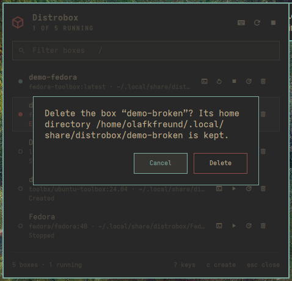
  <figcaption><kbd>x</kbd> names the box and the home directory it keeps, with Cancel selected.</figcaption>
</figure>
<figure class="shot">
  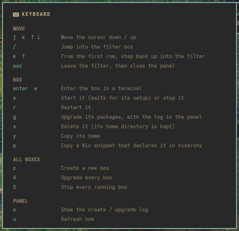
  <figcaption><kbd>?</kbd> lists every key. <kbd>j</kbd> and <kbd>k</kbd> scroll it.</figcaption>
</figure>
</div>

## A tour

<figure class="shot">
  <video controls autoplay muted loop playsinline preload="metadata" aria-label="Recording of the full-screen menu: moving, filtering, the shortcut sheet and promote">
    <source src="img/rec-menu.webm" type="video/webm">
    <source src="img/rec-menu.mp4" type="video/mp4">
  </video>
  <figcaption>The full-screen menu: moving through the boxes, <kbd>/</kbd> to filter, <kbd>?</kbd> for the keys, and <kbd>p</kbd> for a box's snippet.</figcaption>
</figure>
<figure class="shot">
  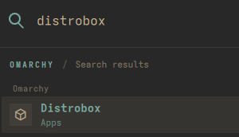
  <figcaption>The <strong>Distrobox</strong> row in the Omarchy menu, from <code>share/omarchy-menu.jsonc</code>.</figcaption>
</figure>

## Set it up

On NixOS with nixarchy, add the flake and install the plugin:

```nix
inputs.nixarchy-distrobox = {
  url = "github:olafkfreund/nixarchy-distrobox";
  inputs.nixpkgs.follows = "nixpkgs";
};

programs.nixarchy.plugins."nixarchy.distrobox".src =
  inputs.nixarchy-distrobox.packages.${pkgs.stdenv.hostPlatform.system}.default;
```

It needs `distrobox` and `podman` (or docker) on your `PATH`. Rebuild, then enable it
once:

```
omarchy plugin enable nixarchy.distrobox
```

Without Nix: `omarchy plugin add https://github.com/olafkfreund/nixarchy-distrobox`,
then the same `enable`.

**Give it a key.** Add this to `~/.config/hypr/bindings.lua`:

```lua
o.bind("SUPER + ALT + D", "Distrobox", "omarchy-shell shell toggle nixarchy.distrobox '{}'")
```

**On docker?** Set **Container engine** to `docker` in the widget's settings.

**[Read the manual](usage/)** for the Omarchy menu row, settings, troubleshooting and
removal. The source is at
[github.com/olafkfreund/nixarchy-distrobox](https://github.com/olafkfreund/nixarchy-distrobox).

---

*Every image on this page is the real plugin on a real machine, driven from the
keyboard. It was captured with throwaway `demo-*` boxes, each with its own home,
which were removed afterwards. Two of the machine's own boxes appear in the list,
with its owner's permission. They, and the machine's settings, were not changed.*
